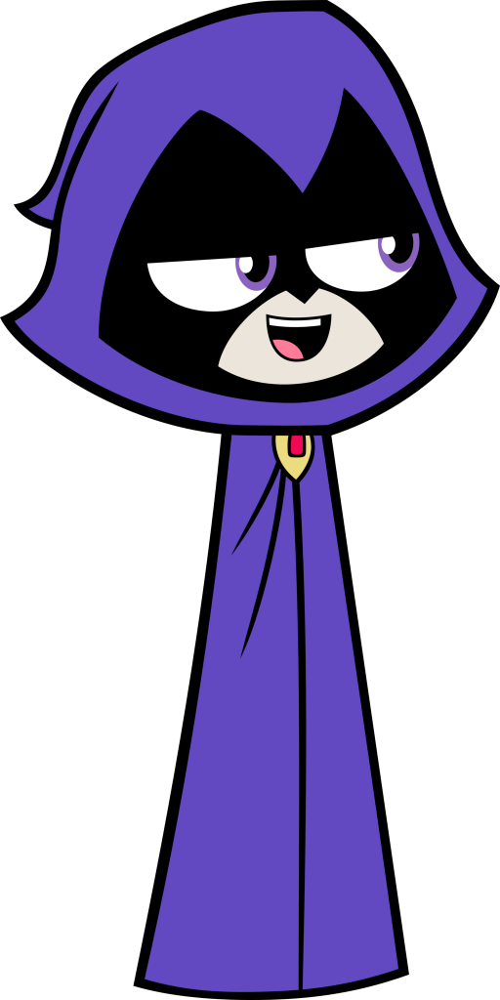
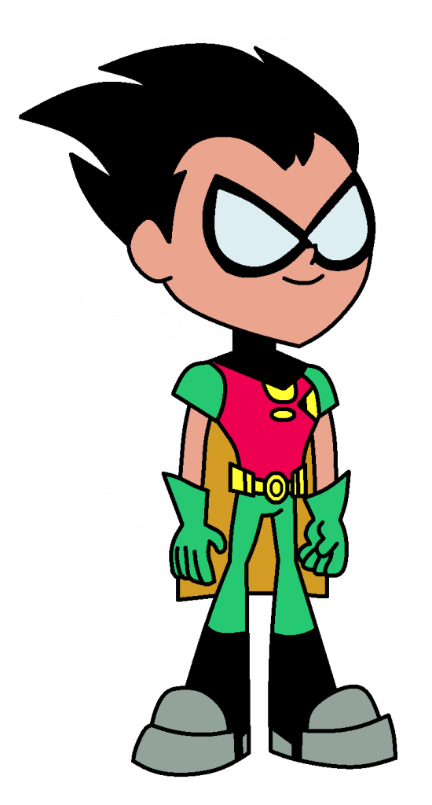
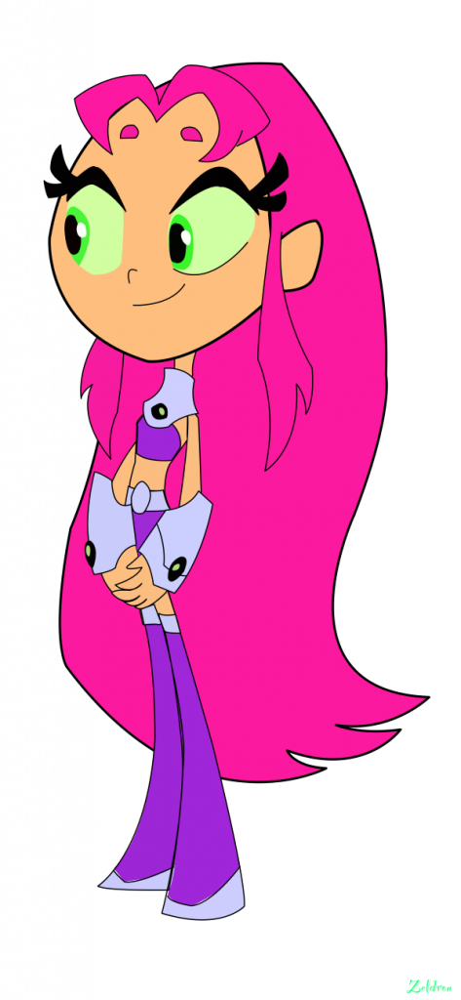
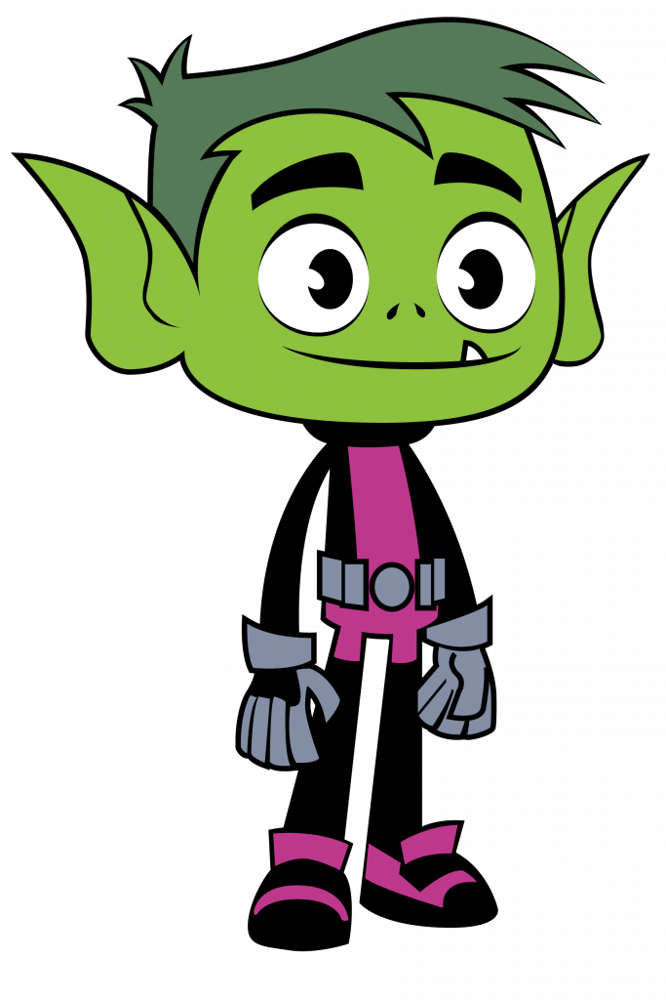
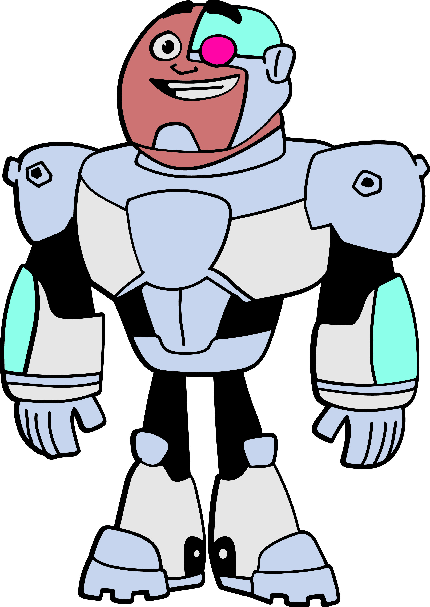

# Jovens Titãs

### Membros Atuais da Equipe

| Heróis | Imagem | Poder |
| ----------- | ----------- | ----------- |
| Ravena |  | Pode se teletransportar e controlar a sua alma, podendo lutar fisicamente, bem como atuar sendo seus olhos e ouvidos mesmo estando longe de seu corpo. |
| Robin |  | Robin não possui poderes, já que é humano, entretanto, utiliza armas e ferramentas em suas missões. Entre elas, podemos listar: bastão(com recursos dentro dele), bombas de fumaça, birdarangs, cabos de grappling, discos elétricos e veículos. |
| Estelar |  | Raios estelares: atirar raios de energia destrutiva através de seu corpo, geralmente mãos e olhos. São raios de energia solar concentrada que podem ser tão quentes quanto o sol. Voo: parte da energia que seu corpo absorve é convertida na habilidade de voar. Ela faz uma espécie de rastro luminoso com seu cabelo ao voar. |
| Mutano |  | Se transforma em qualquer tipo de animal, adquirindo de imediato todas as suas características |
| Cyborg |  | Canhões Lasers: transforma seu braço em diferentes canhões. Lançadores de mísseis: disparar mísseis a partir de lançadores que ficam em torno de seu corpo ou ombros. Voo: voa através de uma mochila a jato. |

### Sobre a Equipe

Cinco adolescentes com superpoderes vivem juntos e tentam combater o crime sem levar um ao outro à loucura. Uma versão adolescente da Liga da Justiça.

##### Para ler mais sobre outras super-equipes [clique aqui](https://github.com/CassiaAlthman/super-equipes)