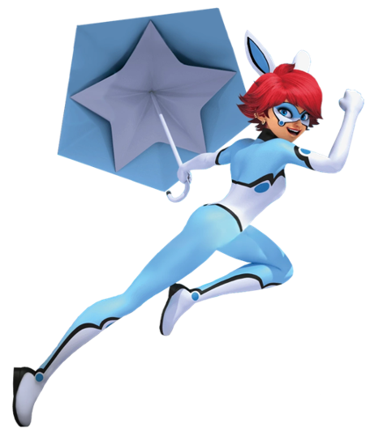

# Miraculous: As Aventuras de Ladybug

### Membros Atuais da Equipe

| Heróis | Imagem | Kwamis | Imagem |
| ----------- | ----------- | ----------- | ----------- |
| LadyBug |  | Tikki |  |
| Cat Noir |  | Plagg |  |
| Bunnyx |  | Fluff |  |

### Outros Membros (não fixos)

| Heróis | Imagem | Kwamis | Imagem |
| ----------- | ----------- | ----------- | ----------- |
| Viperion |  | Sass |  |
| Carapace |  | Wayzz |  |
| Ryuko |  | Longg |  |
| Pegasus |  | Kaalki |  |
| Monkey King |  | Xuppu |  |
| Vesperia |  | Pollen |  |
| Polymouse |  | Mullo |  |
| Pigella |  | Daizzi |  |
| Purple Tigress |  | Roaar |  |
| Miss Hound |  | Barkk |  |
| Rooster Bold |  | Orikko |  |
| Caprikid |  | Ziggy |  |
| Minotaurox |  | Stompp |  |

### Sobre a equipe
A Equipe Francesa de Super-Heróis Miraculosos é uma equipe de super-heróis de portadores miraculosos em Paris, França. Eles procuram derrotar Hawk Moth/Shadow Moth e seus Vilões akumatizados, junto com seus Sentimonstros, para impedi-lo de pegar os Miraculous da Joaninha e o do Gato.

##### Para ler mais sobre outras super-equipes [clique aqui](https://github.com/CassiaAlthman/super-equipes)