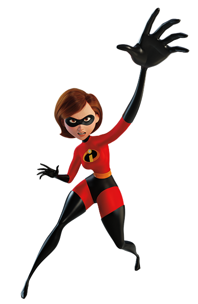
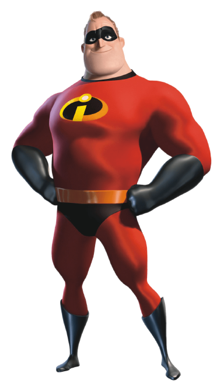
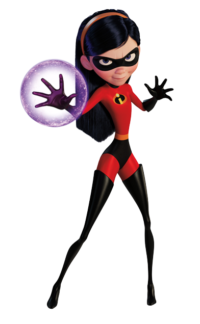
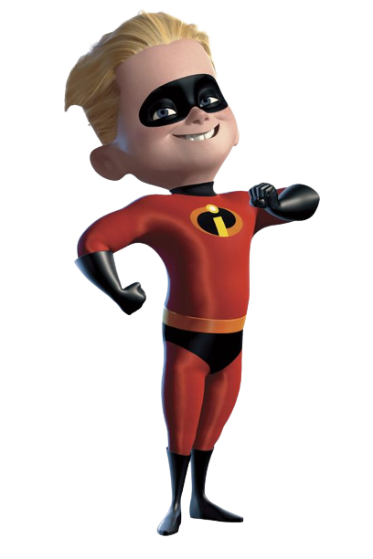
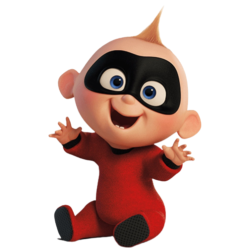

# Os Incríveis

### Membros Atuais da Equipe

| Heróis | Imagem | Poder |
| ----------- | ----------- | ----------- |
| Mulher Elástica |  | Tem a superpotência flexibilidade para que ela possa esticar qualquer parte de seu corpo até 100 pés (30 m) para uma espessura mínima de 1 mm, e moldá-lo em diversos formatos e tamanhos. |
| Sr. Incrível |  | Capaz de resistir a enormes quantidades de trauma físico e forças contundentes, incluindo quedas de vários andares, o impacto direto de um trem, rompendo paredes de tijolos e sobrevivendo a 100.000 volts de eletricidade sob tortura. |
| Violeta Pera |  | Violeta tem o poder de ficar invisível de se esconder atrás de campos de força. |
| Flecha Pera |  | Possui um forte espírito aventureiro e uma fonte inesgotável de energia que são acompanhados pela super velocidade. |
| Zezé Pera |  | Zezé pode: deixar seu corpo inteiro em chamas, mexer em objetos apenas com o poder da mente (telecinese), se auto multiplicar, se levitar, [entre outros](https://recreio.uol.com.br/noticias/entretenimento/afinal-quais-sao-todos-os-poderes-do-zeze-de-os-incriveis.phtml). |

### Sobre a Equipe

Força, elasticidade, rapidez, invisibilidade, mutação. Esses são alguns dos super-poderes apresentados pelos membros da família Incrível. Mesmo em uma família de super heróis, inúmeros problemas surgem e, a cada missão, eles conseguem enfrentá-los e salvar o mundo.

##### Para ler mais sobre outras super-equipes [clique aqui](https://github.com/CassiaAlthman/super-equipes)