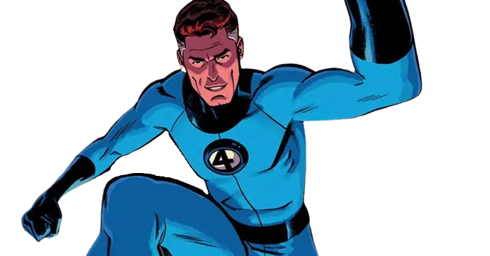
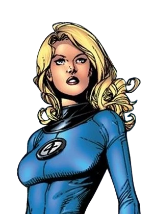
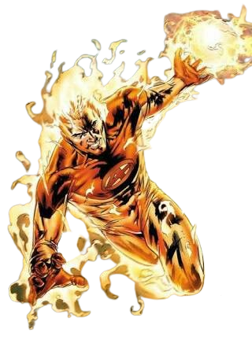
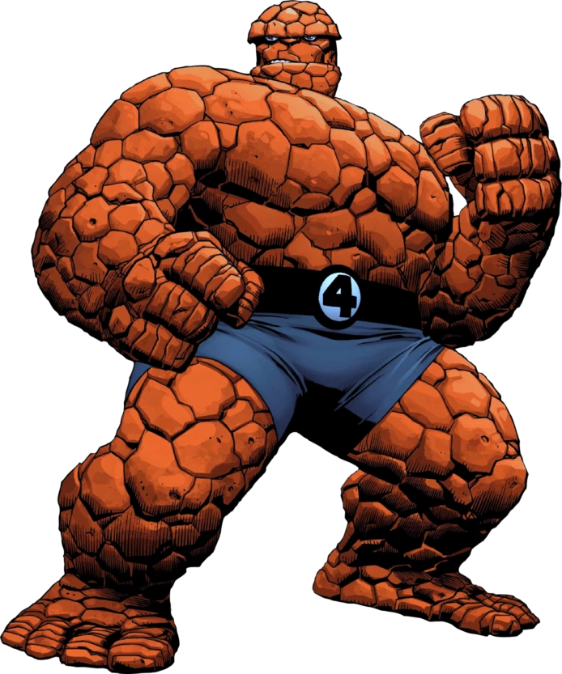

# Quarteto Fantástico

### Membros Atuais da Equipe

| Heróis | Imagem | Poder |
| ----------- | ----------- | ----------- |
| Senhor Fantástico |  | Seu corpo é dotado de uma incrível flexibilidade, podendo se esticar, se contrair ou se deformar como quiser. Ele também pode devolver ataques e resistir a tiros, quedas e outros impactos. |
| Mulher Invisível |  |  Invisibilidade: permite que ela não seja vista e consiga fazer o mesmo com pessoas ao seu redor. Ela é capaz de produzir campos de força psiônicos, que podem tomar qualquer forma que ela preferir. Ademais, ela também consegue criar ilusões. |
| Tocha Humana |  | Tem a capacidade mental de controlar a energia do calor ambiente e a capacidade física de transformar todo o seu corpo, ou partes de seu corpo, em um estado de vontade ardente e semelhante ao plasma. |
| Coisa |  | Ele é extremamente forte e resistente. |

### Sobre a Equipe
O Quarteto Fantástico é uma equipe de super-heróis de histórias em quadrinhos publicados pela Marvel Comics. O Quarteto Fantástico foi o primeiro time de super-herói criado pelo escritor-editor Stan Lee. Embora a formação do grupo mude ocasionalmente, a equipe mantêm-se estável em volta dos quatro amigos que ganharam superpoderes ao serem atingidos pelos raios cósmicos.

##### Para ler mais sobre outras super-equipes [clique aqui](https://github.com/CassiaAlthman/super-equipes)