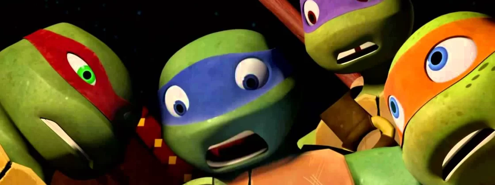
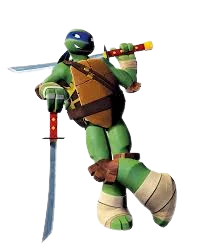
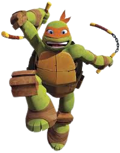
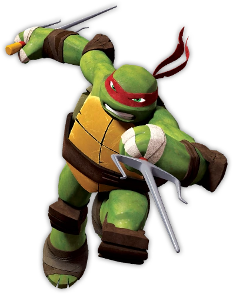
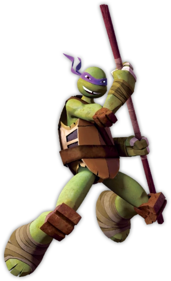
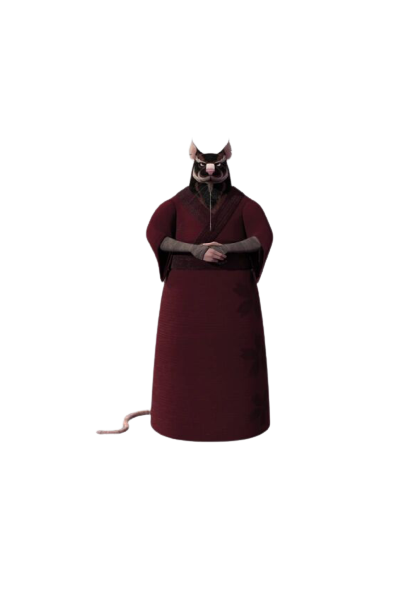

# Tartarugas Ninjas

### Membros Atuais da Equipe

| Heróis | Imagem | Poder |
| ----------- | ----------- | ----------- |
| Leonardo |  | None |
| Michelangelo |  | None |
| Raphael |  | None |
| Donatello |  | None |

### Treinador da Equipe

| Treinador | Imagem | Poder |
| ----------- | ----------- | ----------- |
| Splinter |  | None |

### Sobre a Equipe
As Tartarugas Ninja são quatro tartarugas antropomórficas batizadas com o nome de artistas italianos do Renascimento e treinadas na arte do ninjutsu por um rato sensei antropomórfico chamado Splinter.

##### Para ler mais sobre outras super-equipes [clique aqui](https://github.com/CassiaAlthman/super-equipes)